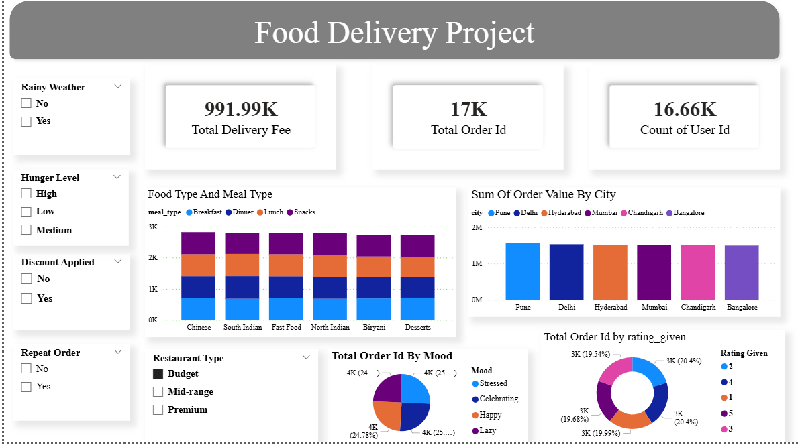

# Food Delivery 

## Project Overview

This project focuses on analyzing food delivery data to extract meaningful insights and support data-driven decision-making. The dataset was sourced from Kaggle and processed using Python, SQL, and Power BI.

## Tools & Technologies
Python (Pandas)
SQL
Power BI
Excel

## Project Workflow

Collected dataset from Kaggle
Cleaned data using Python (handled missing values & removed duplicates)
Performed data analysis using SQL (joins, aggregations, window functions)
Built interactive dashboard using Power BI

## Key Insights

Identified total orders and overall performance
Analyzed city-wise order trends
Found top-performing restaurant types
Observed impact of discounts and external factors like rain

## 

This dashboard visualizes key metrics like total orders, delivery fees, and user count. It analyzes food preferences, city-wise performance, customer mood, and ratings, helping to identify trends and generate business insights.

## Project Structure

dataset-->python_code.ipynb-->sql_queries.sql-->dashboard.pbix

## Conclusion

This project demonstrates my ability to clean, analyze, and visualize data to generate actionable insights using Python, SQL, and Power BI.
